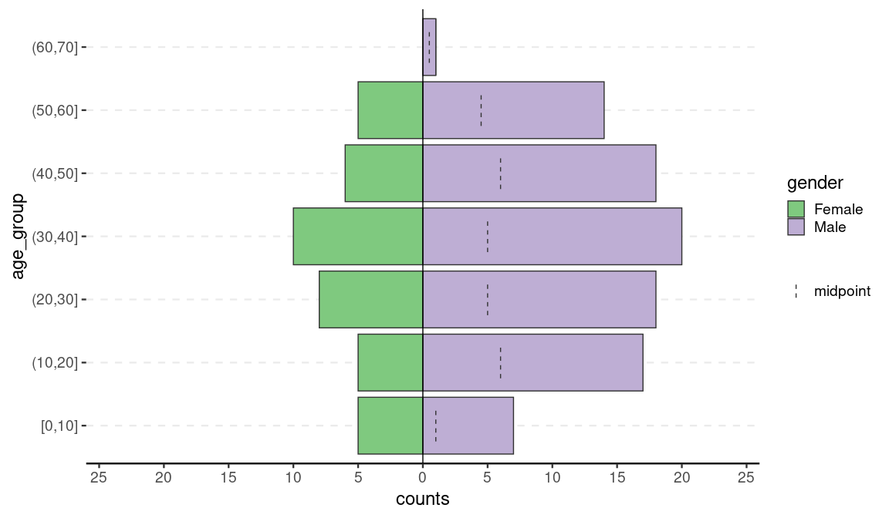
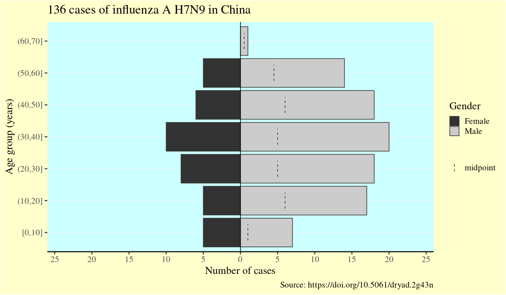
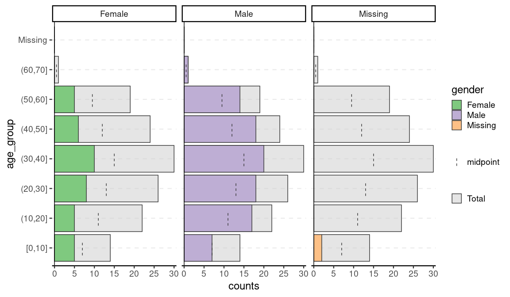
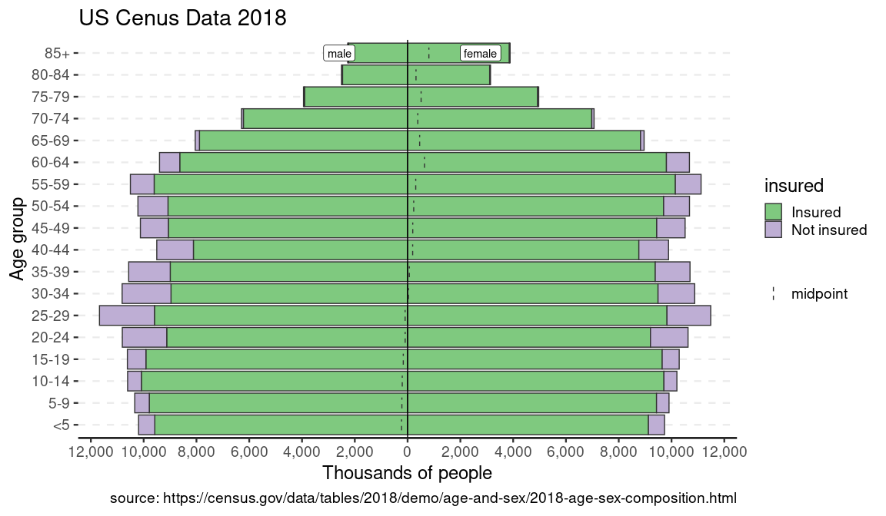
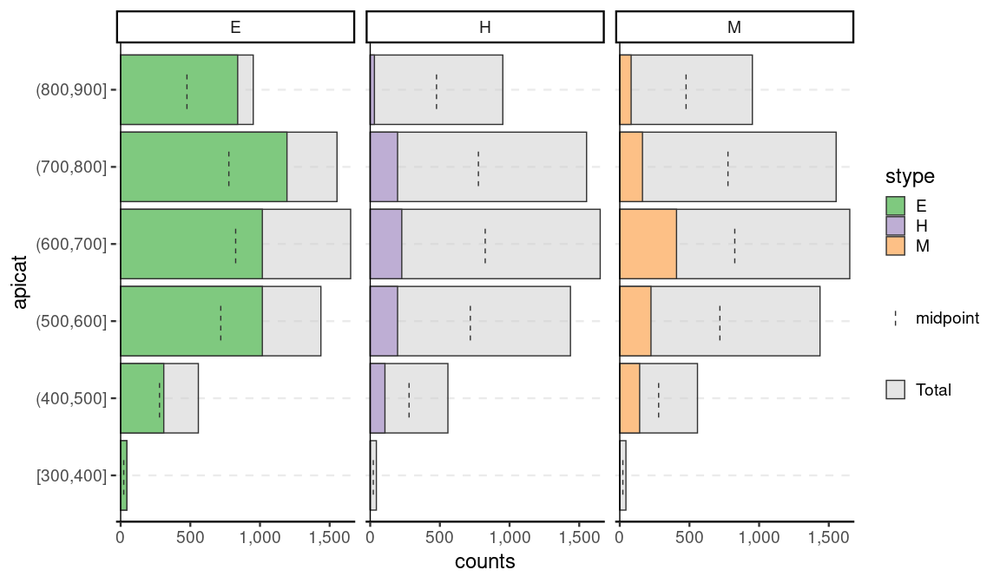

Age Pyramids in R
================

<!-- README.md is generated from README.Rmd. Please edit that file -->

# apyramid

<!-- badges: start -->

[](https://www.tidyverse.org/lifecycle/#experimental)
[](https://CRAN.R-project.org/package=apyramid)
[](https://travis-ci.org/R4EPI/apyramid)
[](https://ci.appveyor.com/project/R4EPI/apyramid)
[](https://codecov.io/gh/R4EPI/apyramid?branch=master)
<!-- badges: end -->

<!--
NOTE: If you want to change anything here, please edit the files listed below.
-->

The goal of {apyramid} is to provide a quick method for visualizing
census data stratified by age and one or two categorical variables
(e.g. gender and health status). This is a product of the R4EPIs
project; learn more at <https://r4epis.netlify.com>.

## Installation

You can install {apyramid} from CRAN:

``` r
install.packages("apyramid")
```

You can also install the development version from GitHub using the
{remotes} package:

The most recent released code is guaranteed to be stable:

``` r
# install.packages("remotes")
remotes::install_github("R4EPI/apyramid@*release") 
```

Otherwise, you can install the bleeding-edge version like so:

``` r
# install.packages("remotes")
remotes::install_github("R4EPI/apyramid") 
```

The {apyramid} package was primarily designed for quick visualisation of
un-aggregated linelist data in field epidemiological situations. It has
one available function:

  - `age_pyramid()` returns age pyramid visualizations of linelist,
    survey, or pre-aggregated census data as a `ggplot` object.

<!-- end list -->

``` r
library("apyramid")
library("ggplot2")   # load ggplot2 to control plot aesthetics
library("outbreaks") # load the outbreaks package for linelist data
old_theme <- theme_set(theme_classic(base_size = 18))
```

## Example

We can demonstrate plotting of un-aggregated data with the
`fluH7N9_china_2013` data set in the {outbreaks} package that records
136 cases of Influenza A H7N9 in China in 2013 (source:
<https://doi.org/10.5061/dryad.2g43n>)

``` r
flu <- outbreaks::fluH7N9_china_2013

# data preparation (create age groups from ages)
autocut <- function(x) {
  cut(x, breaks = pretty(x), right = TRUE, include.lowest = TRUE)
}
flu$age_group <- autocut(as.integer(flu$age))
levels(flu$gender) <- c("Female", "Male")
head(flu)
#>   case_id date_of_onset date_of_hospitalisation date_of_outcome outcome
#> 1       1    2013-02-19                    <NA>      2013-03-04   Death
#> 2       2    2013-02-27              2013-03-03      2013-03-10   Death
#> 3       3    2013-03-09              2013-03-19      2013-04-09   Death
#> 4       4    2013-03-19              2013-03-27            <NA>    <NA>
#> 5       5    2013-03-19              2013-03-30      2013-05-15 Recover
#> 6       6    2013-03-21              2013-03-28      2013-04-26   Death
#>   gender age province age_group
#> 1   Male  87 Shanghai   (50,60]
#> 2   Male  27 Shanghai    [0,10]
#> 3 Female  35    Anhui   (10,20]
#> 4 Female  45  Jiangsu   (10,20]
#> 5 Female  48  Jiangsu   (10,20]
#> 6 Female  32  Jiangsu    [0,10]

flup <- age_pyramid(flu, age_group, split_by = gender)
#> Warning: 2 missing rows were removed (0 values from `age_group` and 2
#> values from `gender`).
flup
```



Since the result is a ggplot2 object, it can be customized like one:

``` r
flup + 
  scale_fill_grey(guide = guide_legend(order = 1)) + 
  theme(text = element_text(size = 18, family = "serif")) + 
  theme(panel.background = element_rect(fill = "#ccffff")) + 
  theme(plot.background = element_rect(fill = "#ffffcc")) + 
  theme(legend.background = element_blank()) +
  labs(
    x       = "Age group (years)",
    y       = "Number of cases",
    fill    = "Gender",
    title   = "136 cases of influenza A H7N9 in China",
    caption = "Source: https://doi.org/10.5061/dryad.2g43n"
  )
#> Scale for 'fill' is already present. Adding another scale for 'fill',
#> which will replace the existing scale.
```



One of the advantages of {apyramid} is that it will adjust to account
for non-binary categorical variables. For example, in the flu data set,
there are two cases with no gender reported. If we set `na.rm = FALSE`,
we can the age distribution of these two cases:

``` r
age_pyramid(flu, age_group, split_by = gender, na.rm = FALSE)
```



## Pre-aggregated data

{apyramid} can also be used to visualize pre-aggregated data. This
example is the US census data from 2018:

``` r
us_labels <- labs(
  x = "Age group", 
  y = "Thousands of people", 
  title = "US Cenus Data 2018",
  caption = "source: https://census.gov/data/tables/2018/demo/age-and-sex/2018-age-sex-composition.html"
)

data(us_2018)
us_2018
#> # A tibble: 36 x 4
#>    age   gender count percent
#>    <fct> <fct>  <int>   <dbl>
#>  1 <5    male   10193     6.4
#>  2 <5    female  9736     5.9
#>  3 5-9   male   10338     6.5
#>  4 5-9   female  9905     6  
#>  5 10-14 male   10607     6.7
#>  6 10-14 female 10204     6.2
#>  7 15-19 male   10617     6.7
#>  8 15-19 female 10291     6.2
#>  9 20-24 male   10809     6.8
#> 10 20-24 female 10625     6.4
#> # … with 26 more rows
p <- age_pyramid(us_2018, age_group = age, split_by = gender, count = count)
p + us_labels
```


You can also use another factor to split the data:

``` r
data(us_ins_2018) # stratified by gender and health insurance status
data(us_gen_2018) # stratified by gender and generational status
p_ins <- age_pyramid(us_ins_2018, age_group = age, split_by = gender, stack_by = insured, count = count)
p_gen <- age_pyramid(us_gen_2018, age_group = age, split_by = gender, stack_by = generation, count = count)
p_ins + us_labels
```



``` r
p_gen + us_labels
```


## Survey Data

Beyond that, survey data can be incorporated with the help of srvyr.
Note that while it will show the weighted counts, it will not show the
confidence intervals as that highly depends on the appropriate choice of
CI estimator. This is meant as more of quick visualization tool for EDA.

``` r
library(srvyr, warn.conflicts = FALSE)
data(api, package = "survey")

dstrata <- apistrat %>%
  mutate(apicat = cut(api00, pretty(api00), include.lowest = TRUE, right = TRUE)) %>%
  as_survey_design(strata = stype, weights = pw)
 
age_pyramid(dstrata, apicat, split_by = stype)
```



``` r

theme_set(old_theme)
```

### Related work

Population pyramids are common tools for epidemiologists and there are
several solutions in R. To our knowledge, the {apyramid} package is the
only one that allows for non-binary splitting
    variable.

  - [pyramid::pyramid()](https://cran.r-project.org/package=pyramid)
  - [epiDisplay::pyramid()](https://cran.r-project.org/package=epiDisplay)
