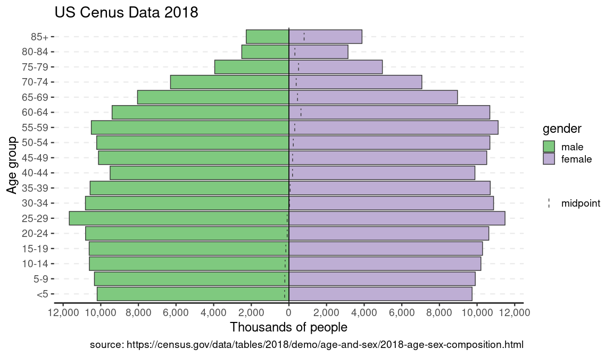
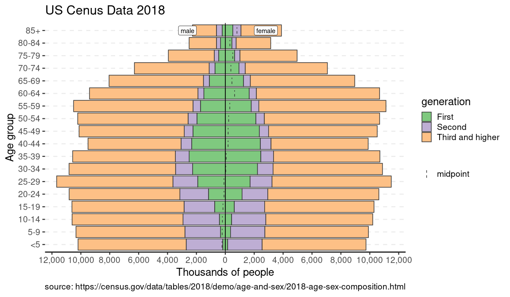

Age Pyramids in R
================

<!-- README.md is generated from README.Rmd. Please edit that file -->

# apyramid

<!-- badges: start -->

[](https://www.tidyverse.org/lifecycle/#experimental)
[](https://CRAN.R-project.org/package=apyramid)
[](https://travis-ci.org/R4EPI/apyramid)
[](https://ci.appveyor.com/project/R4EPI/apyramid)
[](https://codecov.io/gh/R4EPI/apyramid?branch=master)
<!-- badges: end -->

The goal of apyramid is to …

## Installation

You can install the released version of apyramid from
[CRAN](https://CRAN.R-project.org) with:

``` r
install.packages("apyramid")
```

## Example

This can be used to visualize pre-aggregated data. This example is the
US census data from 2018:

``` r
library(apyramid)
library(ggplot2)
old_theme <- theme_set(theme_classic(base_size = 18))

us_labels <- labs(x = "Age group", y = "Thousands of people")
data(us_2018)
us_2018
#> # A tibble: 36 x 4
#>    age   gender count percent
#>    <fct> <fct>  <int>   <dbl>
#>  1 <5    male   10193     6.4
#>  2 <5    female  9736     5.9
#>  3 5-9   male   10338     6.5
#>  4 5-9   female  9905     6  
#>  5 10-14 male   10607     6.7
#>  6 10-14 female 10204     6.2
#>  7 15-19 male   10617     6.7
#>  8 15-19 female 10291     6.2
#>  9 20-24 male   10809     6.8
#> 10 20-24 female 10625     6.4
#> # … with 26 more rows
p <- age_pyramid(us_2018, age_group = age, split_by = gender, count = count)
p + us_labels
```



You can also use another factor to split the data:

``` r
data(us_ins_2018) # stratified by gender and health insurance status
data(us_gen_2018) # stratified by gender and generational status
p_ins <- age_pyramid(us_ins_2018, age_group = age, split_by = gender, stack_by = insured, count = count)
p_gen <- age_pyramid(us_gen_2018, age_group = age, split_by = gender, stack_by = generation, count = count)
p_ins + us_labels
```


``` r
p_gen + us_labels
```



``` r

theme_set(old_theme)
```
